# <center> CyberSecurity Interview CTF Writeups</center>

## 1. **HEIL**
\- By Sahiba

This CTF was the first challenge provided. It goes as follows:

CTF - 


HINT- 


Now, as the hint suggests, we need to use Caesar cipher to solve this CTF. So, I opened Cyberchef and pasted this CTF there and applied Caesar cipher tool, namely ROT13. I used ROT13 because in the hint the format of the flag is given as GDSC_CTF{} and in the CTF text some gibberish text in that format is present. ROT47 was not my preference because it would have shifted all the special characters too which would disturb the format of my flag. So, I applied ROT13 on it and it did not result in the flag.


After checking the hint again, the word `WEEK` was printed in caps and it clicked me to change the rotation amount and enter 7 and see the results.


It again did not result in the flag. So, I entered it in with a negative sign and it worked. I found it to be:

```txt
gdsc_ctf{shift_happens}
```


## 2. **MindROT**
\- By Jaskaran

CTF Text

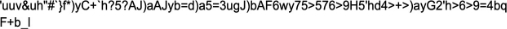

readme.txt

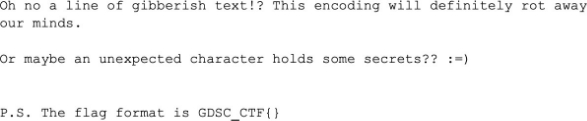

**Solution -**

First thing I do when I see a bunch of gibberish text is to put it in the boxentriq cipher identifier, upon doing that

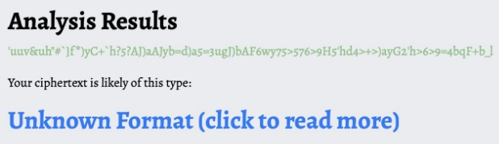

the website returns an unknown format, after this I went through the ieadme.txt, now looking at the title of the ctf as well as reading ‘definitely ROT away’ made me think that the cipher is a Rot cipher(which is a type of keyboard shift cipher) of some kind, so the next step according to me was to run it through iot13 and iot47, once

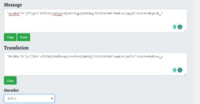

I put it through rot 13 the text came out to be a bunch of gibberish and to my naked eye didn't look like a cipher I could recognize, so I ran it through rot 47 and that returned something interesting, the text was gibberish but there was an = sign at the end of it which usually points to base64,

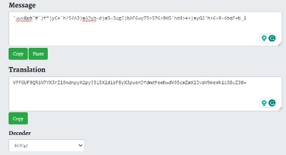

next thing I did was put it through a base64 decoder, and the text was still gibberish here but there were {,}s present which are also present in our flag format,

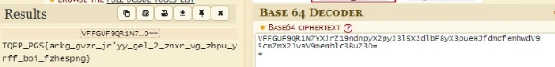

so to investigate it further, I put the text in a cipher identifier tool and it urged me to investigate into rot13,

which was on brand for my suspicions since I thought that the level will be ROT based, upon putting the text in a rot 13 decoder, the flag was there, clear as day in front of us.

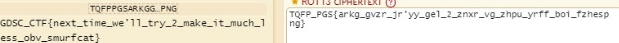


## 3. STRINGS GIBBERISH

### METHOD 1

\- By Gurnoor

**CTF-** [Click Here](https://drive.google.com/file/d/1l0KgPZIHZ9HjtoZAaipxluOH4k2-GzzI/view?usp=drive_link)  


**HINT** - 

```
Can you try to find out the flag from all this gibberish? 
```


Here's a clue: 
``` 
"What's in a name?" - Shakespeare 

Happy Hunting (winkies) 

P.S. The flag format is GDSC_CTF{} 
```


1. I initiated my search for the flag by first directing my attention to “winkies” but unfortunately it proved to be unrelated to the flag. 

2. I reviewed the file thoroughly to notice that title said “strings” gibberish which pointed me to the strings feature in cyberchef. 


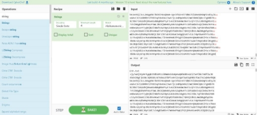 


3. No differences were spotted between the input and the output. Consequently, I chose to explore the features available to us on cyberchef.
4. The ‘display total’ and ‘sort’ features were not of much assistance as anticipated and the outcome I obtained after the application of these was as follows.


5. I could successfully locate the flag after the utilization of the ‘unique’ feature.
6. The flag was ‘GDSC\_CTF{HeY\_yOu\_goT\_THE\_FLaG}’ 

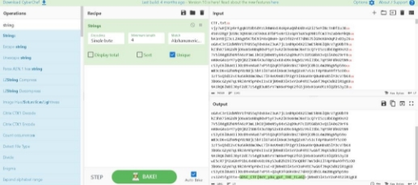


### METHOD 2 
\- By Maihere Singh

1. In the given problem, initially I realized that there was a format of text repeating itself again and again


So, I thought of removing the other repeated text and concentrate on this one paragraph only, but it seemed to be a bad idea because the flag was nowhere to be seen.

2. I shifted to the whole file and simply pressed Ctrl+F to search the initials of the flag i.e. GDSC_CTF.

   

And we got the flag!

The alternate method of solving the challenge could be:

3. Opening the file in linux

4. Searching for the initials of the flag i.e. GDSC_CTF by using grep command.

But this was not necessary in our case, as the given file was in .txt format which made the task even easier.

```text
CTF_Flag: GDSC_CTF{HeY_yOu_goT_THE_FLaG}
```


## **4. Invisible Ink**
\- by Rudra Nautiyal

Steganography, the art of hiding information within other data, has been a timeless technique employed by cryptographers to transmit secret messages discreetly.

"Invisible Ink" makes use of this concept by presenting participants with an image that appears to be nothing more than a digital canvas.

Let take a look at the picture!

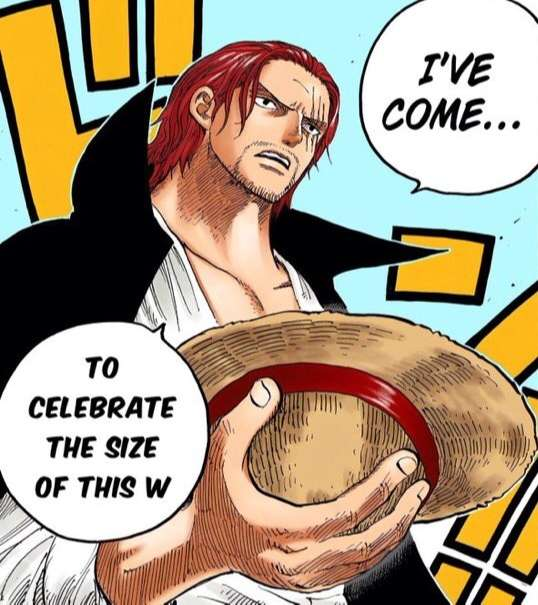

The hint for the same being,

```text
It is hidden just like the one piece.

But not in a place as harsh as the Grand Line. Maybe it's all about our own character?

P.S. The flag format is GDSC_CTF{}
```

Oh no, we've just abandoned our pirate persona, and now they're asking us to revive it? This can't be happening; we need to resolve this situation promptly.໒(⊙ᴗ⊙)७✎▤

If you've had the opportunity to review the initial PDF document provided, the process for extracting the flag is straightforward.

- Open the image file using Notepad.

- Execute a `Ctrl+F` command to initiate the find function.

- Conduct a search specifically for the flag labelled as GDSC_CTF.

This step-by-step approach ensures a systematic exploration of the image file's contents, making it easier to locate and identify the desired flag within the given context.

Let’s take a look now.

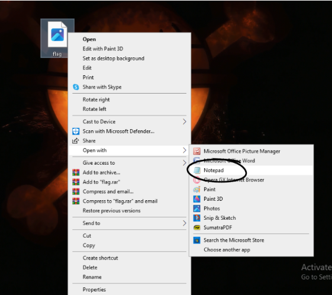

Opening in Notepad and then searching for the flag we get .

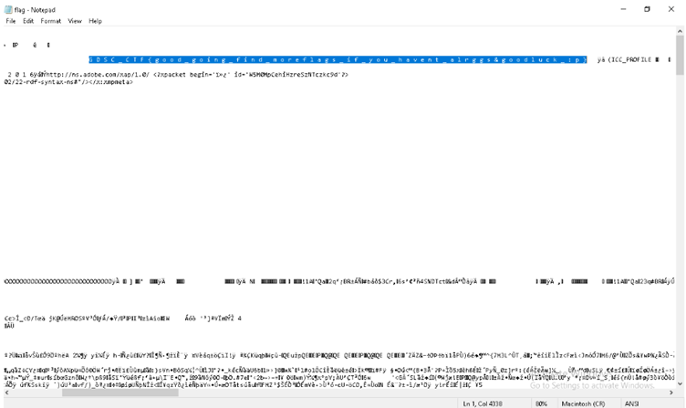

Yay, we found the flag, it’s 

```
G D S C _ C T F { g o o d _ g o i n g _ f i n d _ m o r e f l a g s _ i f _ y o u _ h a v e n t _ a l r g g s & g o o d l u c k _ : p }
```

Great job! Nowhere as difficult as finding the ONE PIECE.(⌐■_■)

## **5. Cryptic Wave**
\- by Hargun Kaur

This was the most interesting and fun CTF for me.

CTF:


Flag text:

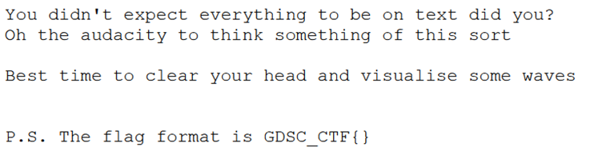

For this, I had a hunch that this one would not be solved like the others and I probably needed to download something for this. This suspicion of mine was confirmed by a member of GDSC Cyber security. After doing some research, I discovered that this was a case of Audio Steganography I then downloaded the Sonic Visualiser application and opened the given cryptic.wav file with the app.

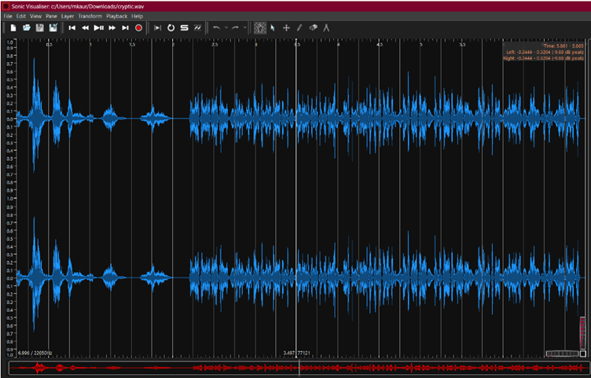

This looked both very cool and overwhelming as I did not know how to use the application. So I decided to just play around with the features. I stumbled upon the Pane dropdown menu. I tried out the features one by one where the "Add Waveform" feature did nothing but duplicate the already given waveform but just in a different colour.

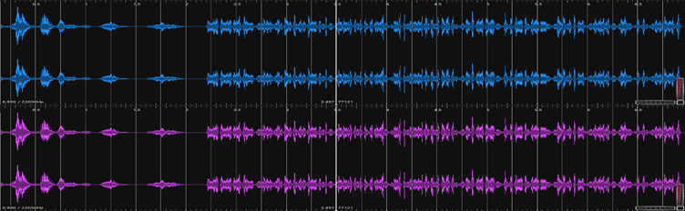

Then I did `Ctrl+Z` to undo the Waveform addition and I tried out the “Add Spectogram” feature.

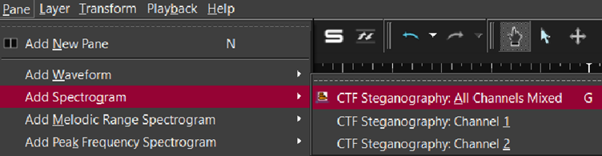

It gave me the following output:

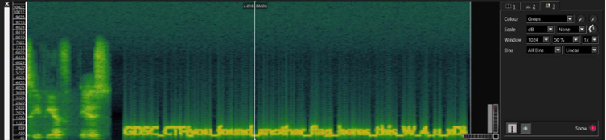

I changed its colour from the interactive dropdown menu on the right and got the following flag:

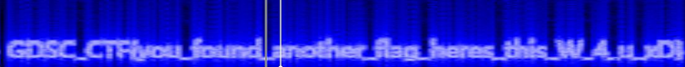

Flag:

```
GDSC_CTF{you_found_another_flag_heres_this_W_4_u_xD}
```

  

## **6. Multilingual Mystery**
\- by Jaskaran Singh

CTF Text

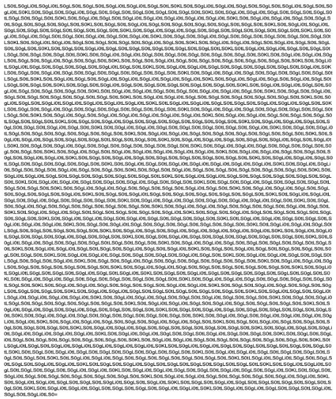

readme.txt

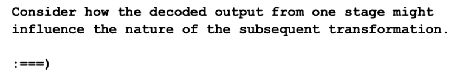

## **Solution –**

After I read the CTF text, going by experience when a text is repeated it usually ends up being Binary or Morse, then I went through the readme.txt but that put me very o track because I knew that I had to focus on “ :\=\==) ” but wasn’t really sure what to make of it, another thing that the readme made clear was that it will require more than one transformations, so my first step of action is to put it in boxentriq’s cipher identifier even though the '=' at the end of the text made it somewhat evident that it might be base64,

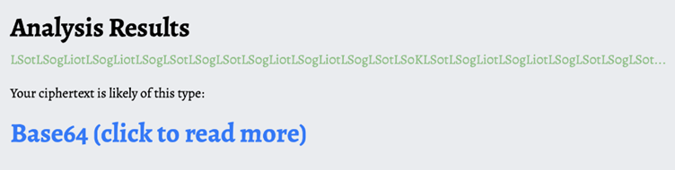

all it did was confirm my suspicions,

Then decoding it using base64, I got dashes and dots and owing to my previous suspicions I figured it to be Morse Code, Upon getting the morse code, I used boxentriq’s morse code to text converted and all it gave was a bunch of 0s and 1s which was very clearly binary,

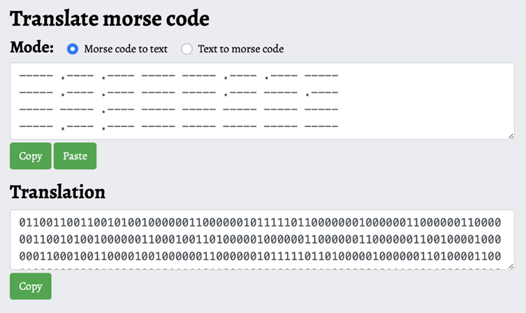

now using a basic Binary to Text converter all I got was gibberish

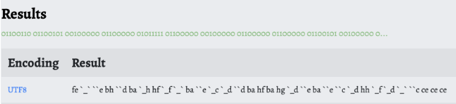

putting the text into dcode’s cipher identifier , it suggested me to investigate rot47

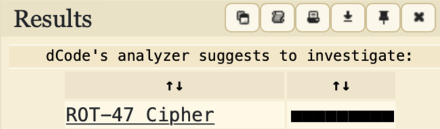

and upon decoding it using dcode’s rot47 decoder, I got a bunch of numbers spaced out which were very clearly decimal codes,

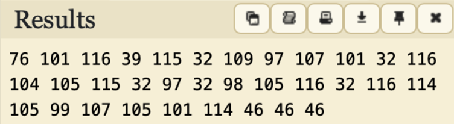

now putting it into a decimal-to-text converter, gave me a bunch of plain text which putting it into the flag’s format gave us the answer to the CTF

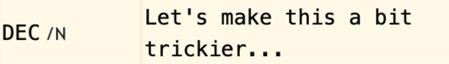

**Flag** –

```
Let’s make this a bit trickier…
```